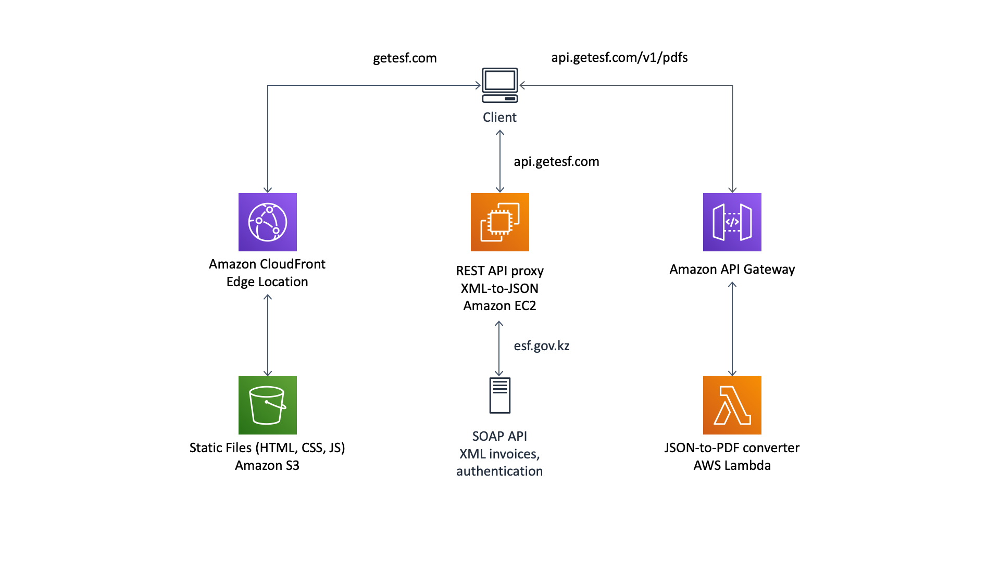

[](https://circleci.com/gh/timurengineer/esf-web-client)

# GetESF Web App

### Prerequisites
- REST API proxy: https://github.com/timurengineer/esf-rest-proxy
- JSON-to-PDF AWS Lambda: https://github.com/timurengineer/esf-pdf-lambda
- Node.js 10+ (https://nodejs.org/en/download/package-manager)

### Quick start

```
$ git clone https://github.com/timurengineer/esf-web-client.git
$ cd esf-web-client
$ npm install
$ npm start
```
